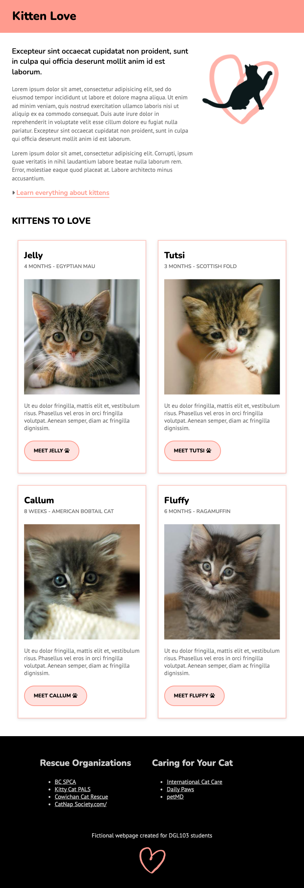
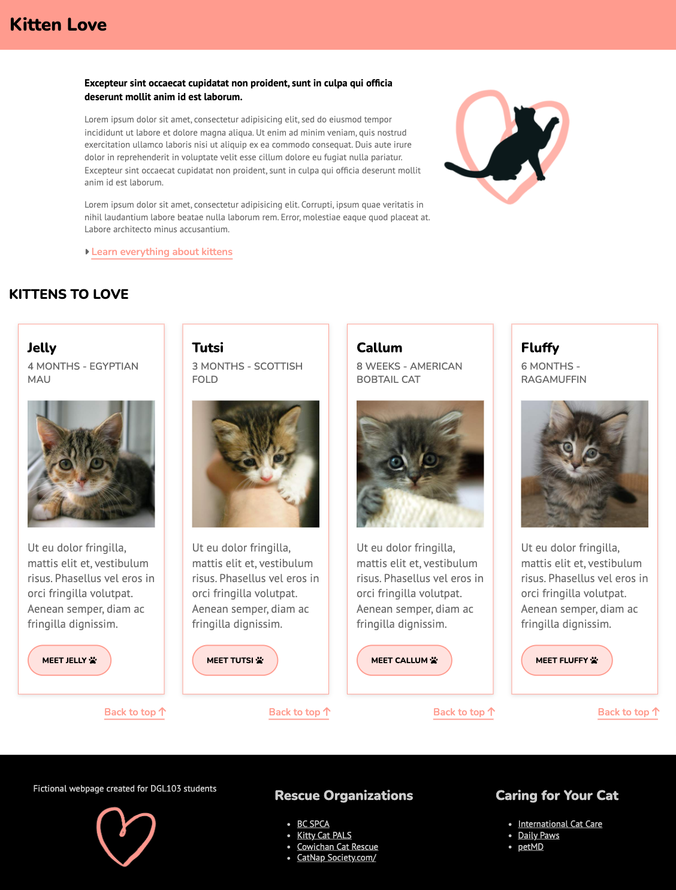

# Responsive Layout - In-class PractoicePractice

## Objectives
You will use the provided HTML and CSS as a starting point, and add to it so that the layout looks like the provided examples and works on all screen sizes up to 1024px wide.

## Instructions

### 1. Get Set up
In Github, click on the green Code button > Select Download ZIP. Find the ZIP file in your Downloads folder and move it to an apporpriate location on your computer. Unzip the file. Open the unzipped folder in VSCode.

View the web page at a small window size to simulate what it might look like on a mobile device: 
  1. Open index.html in Chrome > right-click > Inspect. 
  2. In the DevTools window, click on the Toggle Device button (in top left-hand corner).
  3. In the browser window, select iPhone SE from the Dimensions drop down menu.

### 2. Introduce a new breakpoint for ipads
  1. In the browser window, select iPad Mini from the Dimensions drop down menu.
  2. Add the following media query at the bottom of your CSS:
```
  /* Medium devices (vertical ipads, 768px and up) */
@media only screen and (min-width: 768px) {

}
```
  3. Add, in the media query, all the CSS necessary to make the page look like the example below. You may need to add some HTML to control the relationships between your flex containers and flex items.<br>
  

### 3. Create another breakpoint for large screens
  1. In the browser window, select Responsive from the Dimensions drop down menu. Type 1200 in the first text field to change the width of the viewport.
  Note: If the computer that you are working on has a small screen and you can't see the whole viewport window then you may need to work on a lab computer.
  2. Add the following media query at the bottom of your CSS:
```
/* Large devices (small laptops, 1200px and up) */
@media only screen and (min-width: 1200px) {

}
```
  3. Add, in the media query, all the CSS necessary to make the page look like the example below. When you style the footer, read up on using the flexbox container proprerty called gap: https://www.w3schools.com/cssref/css3_pr_gap.php<br>
  

### 4. Check the layout in between the breakpoints
  1. In the browser window, select Responsive from the Dimensions drop down menu.
  2. Drag to expand your viewport width. Check that the layout works on all screen sizes, even between the breakpoints. Look for anything that needs to be fine-tuned, for example, the line length might become too long for the text to be easily readable. Or perhaps the page becomes wide enough that it no long makes sense for the images to display in a stack.
  3. If anything needs to be tweaked, record the viewport width at this point. Add a new media query using the width of the viewport as the min-width.
  4. Add any necessary CSS to make the layout work.

